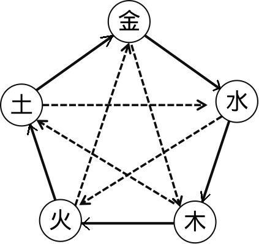
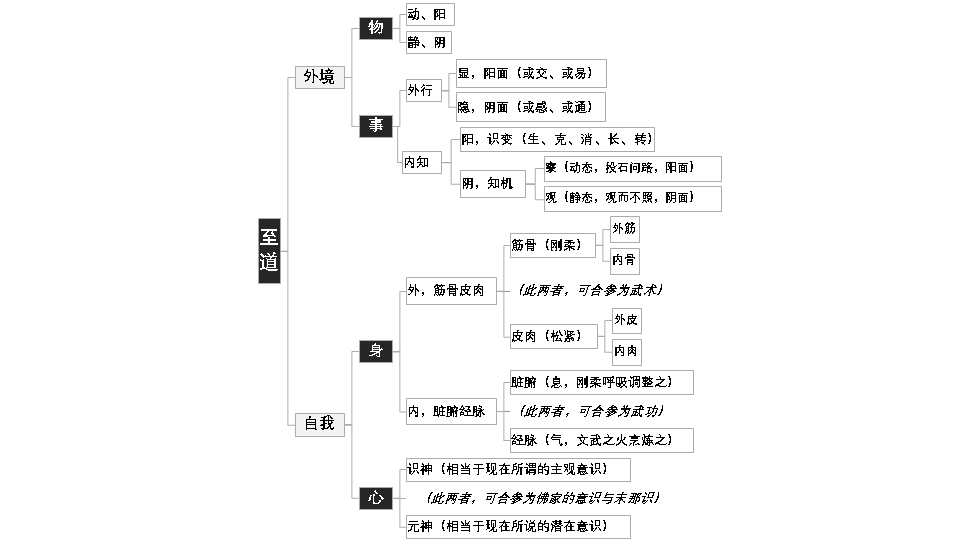

### 洞悉天行的眼力之一

   下面看全经的第二句：“天有五贼，见之者昌”

   天道变化的要点，有五个，有五种，见到的人，就“昌”。昌，有两解，一个，是昌明，明白；另一个，是繁荣兴旺，昌盛。
   这句话的意思是说，知道到“五贼”规律的人，就不会迷惑，就明白；或者说，知道的人就“昌盛”。两种解法都说得通。

   “观天之道，执天之行，尽矣”是全文的纲领，而“天有五贼，见之者昌”就是全文的“文眼”，是整部经的“眼目”所在。整个《阴符经》中，最为重要与最为困难的东西，就在这个地方，这个地方一通，全文就很容易通，这个地方不通，全文对我们来说，就完全是天书。

   什么是“五贼”？关于这个“五贼”，见之于典籍的解释主要有两种，既然见之于典籍，不妨就称其为“显”的解。不过，本经的名称是《阴符经》，还有一个不见之于典籍的解，“阴”下来的解。我们还是“先显后秘”，先讲显的、书上有记载的对这五贼的解释，然后再谈“暗藏”的，“阴”的解。其实这个阴的解，也并没有那么神秘，就是显解的深化而已。

### 五贼即是五行

   李筌的注释说，“五贼”即是“五行”。行者，变也，也就是指事物的五种基本变化方式。
   关于“五行”，请看附图。整个图，用现代“数学建模”的理论来看，就是一个描述事物变化规律的“模型”。

   五行，金木水火土，讲生讲克，我们现在很多人往往把这个“金木水火土”认成“死”的，没有想到这个“金木水火土”其实只是代号。就像数学中间的XY一样，只是代号，其实并不是真正“实指”有属性为金、为木、为土、为火、为水的东西存在。这些“属性”，都是人为定义的，是人为添加到事物身上去的，事物本身是没有这些东西的。相应的，比如古印度讲整个世界的构成，讲的就是“地水火风空”，并不是“金木水火土”。可见这些概念仅仅只是“名相”，并不是事物真正“实有”这样的属性存在。所以，传统的这个图中，金木水火土，就算我们用英文字母abcde来代替，意义也不会有什么太大的变化。那么，这个图究竟是想向我们传递什么样的规律或者道理呢？

   1、循环。这个图中，无论是看“生”，还是看“克”，什么地方是“始”什么地方是“终”？没有嘛。整个图一直处在循环与运动当中。整个世界，整个宇宙，整个人类社会，也是在这样不断的运动与变化当中，事物的变化相互牵制，相互助长，不断地演变下去。

   2、平衡。金木水火土，平等。这个图中的“五行”，五个点，哪一个占主导地位呢？也没有嘛。就算在某时某地，某个“行”强于其他的“行”，但一循环，一开始运动与变化，就会有生克，一有生克，最后必然会重新回到“平衡”，这种平衡，当然是“动态”的平衡。

   有了循环与平衡，那么整个“天道”的运化，整个宇宙、世界的运化，就会显示出一个整体上的状态——和谐。当然，这种和谐，也是动态的，并不是绝对的。

   此处说到五行的这个图，向我们传递的规律就是“循环”与“平衡”。以下我们的讨论也将围绕这两点来谈。但是，这个图有一个非常重要的问题，是我非常想聊一聊的。这个问题就是：为什么是五行而不是四行或者六行？古人到底为什么确定在这个图中使用“五”这个数？之所以想聊这个问题，是因为看到现在很多学道、学中医或者学习传统术数的朋友，脑袋僵化得可怕，完全将传统这个“五行理论”给曲解了。自己曲解了不说，还将错误的观念来拿四处宣传，造成现代人对道术是“迷信”的看法也越加严重。但是，谈这个问题会牵涉到传统术数中很多的基础知识，与本文的关系不大，只好留等今后有机会再来聊聊这个话题。总之，想说的一个重点就是，五行这个图，并不是迷信，确实有其深远的、唯物的原理在其中，并不是唯心的东西，更不是某人想当然画出这么个图来愚弄他人的。

### 道家的五行修养体系

   对古图的运用，最大的问题，是我们多半用它来认识事物，分析事物的变化规律，把它当成了一种外用的“工具”，而往往忽视了它在心性修养上对我们的指导作用。关于这一点，也是非常的无奈。因为传统之中，无论是在民间，还是在道家内，“国之利器不可示人”的保守之风是深入骨髓的。真正明白其中关窍的人不肯说，荒唐的是，说出来也没人相信，因为太过简单、太过平凡，一点也不神奇，难免“说穿笑煞人”嘛。

   将古图用在分析事物变化规律上，最典型的例子当然就是种种占卜之术，各种天干地支，相生相克，讲得天花乱坠。将古图用在我们自身的内在修养上，就是道家所谓的“内五行”，用在处理外界事物上，就是道家所谓的“外五行”。内五行，本身又有阴阳之分，当然，外五行，本身也有阴阳之分。这里，我们先给出属于道家内“不传之秘”的“学修体系图”，让大家先有个整体上的了解，然后，我们再来细说内五行与外五行各自的内涵。

   众所周知，道家的思想根源在于“阴阳”二字。以下，先请看图，特别要注意的是，图中任意两条并行的线索，都是按阴、阳来区别的。本经名为“阴符”所以图中真正的重中之重，就是“阴中之阴”的、“纯阴”的那条线索——是什么？

   这个图，年代久远，我是一半凭记忆，另一半凭自己的理解画出来的。学修的基本体系，应该就是如图所示这样的。以下对这个图进行一点解说。

   我们要学修“至道”，那么按阴阳，将其分为两半，阴的一半是“自我”，阳的一半是“外境”。其中，“外境”，又按阴阳，分为阳面的“物”与阴面的“事”。“自我”这半，则分为阳面的物质“身体”与阴面的精神“内心”。所以，道家学术，整体上其实只有四个方面，就是：物、事、身、心。

   物中的阳面，为“动”态的物，不完全是我们现在理解的“动物”，而是动态的，诸如风云雨雪之类，当然也包括我们现在理解的所谓“动物”；阴面，是“静”态的物，诸如花草树木、锅碗瓢盆之类，都是。

   事中的阳面，是我们处理与对待事情之时的行为，属于“动”态；事中的阴面，是我们内在的“知见”，属于“静”态。知与行二者共同的作用，构成了所谓的“事”。

   在“事”中，“行”这面，又分阴阳。阳面是“交易”。这里的“交易”二字，不是现代理解的“作生意”的那个“交易”，而是《易经》中“交易”的意思——交，是联合、组合、同盟、结盟，性质是双边力量、物质或者实力的结合；易，是交换，性质是双边力量、物质或实力的互相交换。交，是“行”中“交易”这块儿的阴面；易，是“行”中“交易”这块儿的阳面。“行”本身阴的那面，是感或者通。其中，“感”又是阴面，表示双方相互产生影响，比如我们感动了他人，就是“感”；“通”则是“感通”中的阳面，表示双方相互之间有交流。按《易经》的说法“感而遂通”，先必须要有感，然后才谈得上通。当然，“行”最理想的状态，是从阴到阳——先感、再通、再交、最后易。为什么是这个顺序，大家不妨可以品味一番。关于“感通”与“交易”，我们会在本次讲座最后讲全经下篇的时候，再次详细讨论。此处不再多说。

   在“事”中，“知”这面，同样分阴阳。阳面是“识变”，明白一切事物变化的规律，即：生克、消长、转化等（我们后文会非常详细地解说这个内容）；阴面，是知机，也就是知道事物发生、发展、变化的“机”。知机的方式，我们在前文曾略讨论过，就是阴面的“观”与阳面的“察”两种方式。这个图，有些细节我已记不清了，所以没有完全画出来。比如这里，观之下，其实还有阴观阳观之分，察之下，也还有阴察阳察之分。每种分法，各有其观与察的侧重点。阴观大致是观属于“质”的：形、质、声、色等；阳观大致是观属于“量”的：数量、轻重、长短、多少等；阳察大致是察属于“相”的：向背、反应、决断、盛衰等；阴察大致是察属于“状”的：速度、缓急、宽严、频率等。这些观察得来的东西，提供给“行”作为参考。这个方面的内容，由于我本人从来没有实际运用过，所以我已记不太清楚。总之，看到这个图，想必大家会明白，道家的术数，确实有其唯物的根子在的，并不是唯心的迷信。

   图中，“自我”这部分，其实我们在前面讨论“道佛两家眼中的性与命”时，已经将其体系大致说过，这里就不再多啰嗦了。

   事实上，这个图，不仅限用于道家，就算放在传统学术整体上的结构来看，应该说也可以“通用”：“物”这面，可以学学邵康节的《观物内、外篇》；“事”这面，先学《通书》或者干脆什么也不学，先磨心气与心性，磨好之后再看看《淮南子》《吕氏春秋》或者冯梦龙的《智囊》之类就足够了；“身体”这面，可以学学诸如“太极拳”之类；唯独精神思维与心理这块儿，佛家的“唯识学”肯定是最佳选择，可惜要花大力气，而且还很可能花了力气也未必能弄明白，退而求其次，《楞严经》《楞伽经》可观，但对于现代生活节奏中的人来说，恐怕仍嫌复杂，再退，那么《庄子》《菜根谭》之类，应该是能够让人有些感受的了。

   这四个方面整体来看，如果按道家真正的传统来说，要想要全部彻底弄明白的话，老实说，我觉得现代生活节奏中的人基本上不可能。除非十二三岁就开始进行专门的学习。而这样的学习中，真正最花时间的，就是精神、心性或者说“识神”与“元神”这块儿，这是内五行中的内五行，后文我们聊道家育人之道时，会谈到如何进行“识神”的训练。其它三方面的内容，其实不超过三年就可以全部学完。不过，就算是学完，也仅仅只是“知”，行，则还不知要花多长的时间。

   上面所说，将整个的学修体系分成了四个部分。其实，这四者仍然是一体的。比如，我们健身，要对我们的肉体进行训练，这不但属于“身”这部分，其本身同样也是一件“事”，所以仍然包含着“事”中的要点：知见、认识与具体用什么方法来“实行”等等。我们要做事，做事之时难免会显示出我们的心性与心量等等，我们的心性水平肯定会对我们所做的事产生影响，所以“事”与“心”其实也是不可能截然分开的。说到底这四个方面，实质上仍然是浑然的整体。

   传统之中，外五行多半被用在了对“事”的处理上，比如我们后文将讲到的“五贼”理论中“阴”的那套说法，而用在“物”方面最明显的例子，就是中药的“四气五味”；内五行多半被用在了对肉体的修炼上面，比如练“筋骨皮肉”的五种基本桩子（马步土、弓步木、虚步火、歇步金、仆步水，然后按生或者克进行变化）与练“脏腑经脉”的“五气朝元”“五雷轰顶”等等。如何将五行理论用在对精神、心性的调理上来，这个方面少有人谈，而且就算谈到，也谈得不怎么充分。

   从上面这个划分大家不难看出，在道家内部，这内、外五行具体运用，是有非常细致与宏大的理论体系存在的。上面给出的整体上的结构，其实是已经把道家的“不传之秘”东西公开了，如果有心，已经可以从这个整体的结构上，品味出一些名堂来了。我们下面着重要讲的，还是立足在“阴”面的“阴”面，讲讲道家“内五行”中，关于心性修养方面的一些问题。在此，我们不妨先把结论说在前面，然后下文再详细讨论。结论就是，我们的心性，一定要处在“通、活、虚、大、定”，这五个要点上面。下面不分先后，我们分别来看看这五个要点。